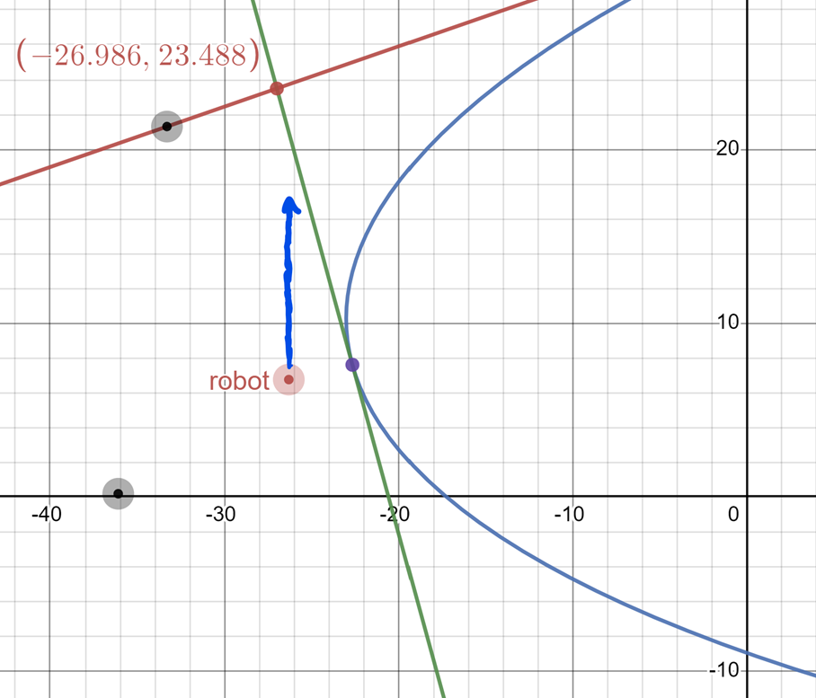
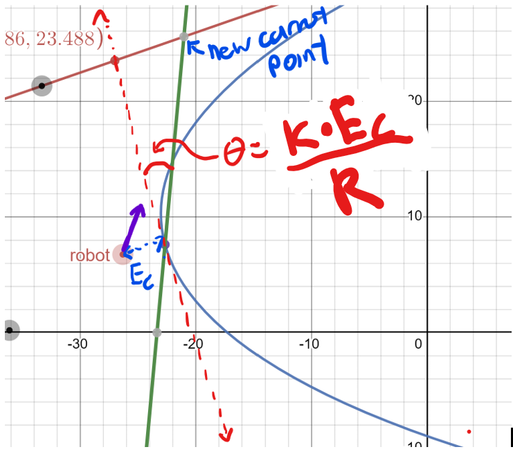
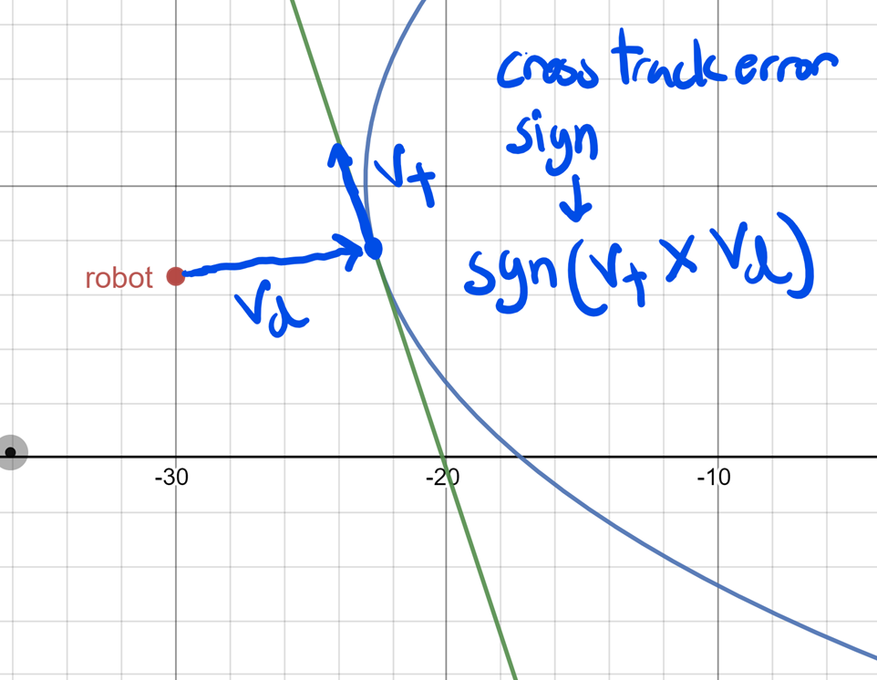

# Tangent-Intersection-Method-For-Path-Following

In the Repo above I’ve created a new algorithm of following continuous and structured paths for wheeled mobile robots.
The benefits of this algorithm compared to others are listed later in the document. 

Now here’s the actual algorithm explained:

Note: in my explanation I use a Cubic Bezier curve as the path to follow. 

1.  Given the curve B(X), we find the line tangent to the very last point on this curve. This line will be called line_endingPointTangent.

2.	Given our robot's current position (x_start, y_start), we find the point that we are closest to on the curve B(X). This point is called (x_closest, y_closest).

3.	We then find the line tangent to (x_closest, y_closest), called line_closestPointTangent

4.	We then find the signed cross track error of our robot to the curve. We then rotate line_closetPointTangent by an angle proportional to the signed cross track error to minimize this error so our robot can accurately be on top of the path. (This step is not illustrated above as it is explained in greater detail later in the document)
5.	The intersection point between the two lines is the carrot point that our robot attempts to follow. 

6.	We calculate our angular and linear power needed to move to the carrot point and we then input them to the control system. 
7.	This is then repeated in a while loop until we reach the end of the curve. (So essentially, we are following a dynamically changing carrot point to follow our path). 

The whole Algorithm is modeled in the pictures (without step 4 for now for clarity) shown below: 

In the given picture, the blue curve is B(X)
The red line is line_endingPointTangent
The purple point labeled robot is our starting point.
And the green line is the tangent line closest to our robots’ starting position. 
And the carrot point is at the intersection of the green and red lines. 

The following images show more carrot points as the robot moves along the curve.

This is the Desmos to model this situation, made by [SecretAgent](https://github.com/SecretAgent-YT) https://www.desmos.com/calculator/axcqmxr9wz (scroll down to the t_c variable for more control)
As you can see, by following the carrot point created by the intersection of these two lines, the robot naturally follows the curve. It is constantly moving along the derivatives of the curve which means it will follow out the path created by the curve. 

Furthermore, it is extremely hard for the robot to stray away from the curve, as the robot is mathematically bounded by the ending point tangent line. In other words, due to the nature of carrot point generations, the robot is always behind the carrot point. And since the carrot points are all generated on the ending point tangent line, the robot will always be below the ending point tangent line (which means  it is bounded below the tangent line). This means that the robot will always be in the region below the ending point tangent line, which allows for more consistency, since you are guaranteed to be in a specific region while and after traversing the path. 

This also means that path following will be much more accurate even in the event of catastrophic failure, as the robot wont stray away extremely far from the path since the robot will be bounded by the tangent line (if the robot gets knocked above the tangent line, carrot point generation forces the robot to seek back underneath the tangent line). 
Another way to look at this is if you play the Desmos simulation, you can see that the robot is always below and behind the carrot point. And since the carrot point is always going to be on the ending tangent line, the robot physically won’t be able to go pass the ending point tangent line, meaning it is bounded by this line and thus has the benefits mentioned above. 

The even better part of this is, there are SOME instances where by following the carrot point, the robot implicitly moves closer to the curve, limiting cross track error. If the blue point was the robot, it is implicitly moving closer to the curve. However, this is only true some of the time. For a more general way of moving closer to the curve, we have a cross track minimization algorithm which is explained later in the document. 

This algorithm is extremely well suited for differential drive robots. Since we are simply just moving to a dynamically changing point, there are no steering limitations or need for doing so. This means that there are no constraints on the angular velocity, allowing differential drives to move to their fullest potential. 

Furthermore, the algorithm is very simple and easy to implement, as it requires no feedforward or velocity control (by this, I mean you don’t need to know the current velocity of your robot and need to know how to convert voltage into the velocity of your robot). Controlling the robot simply through a plain PID voltage control, without the added complexity of converting it to the robot’s actual velocity, is more than enough to accurately follow the path. Additionally, the general idea of the algorithm is easy to implement because the algorithm is just effectively moving to a dynamically changing carrot point, meaning a large portion of the control section of code is just a simple move to point algorithm, which almost anyone can do. 

The algorithm is also extremely memory and time efficient if you are using a closed form curve as your path, like a Bezier curve, as you are not required to pre generate the points on the path before starting the motion algorithm, like you do with some algorithms like motion profiling. The only thing the algorithm needs is the derivative of the Bezier curve at a constant point (the end), and the closest point to the robot on the Bezier curve, and its derivative. This information can all be retrieved in O(1) time, as it goes along the curve using the closed form solution, meaning we can save tons of time and memory. 

However, you may have noticed that there is a small little edge case. What if the carrot point gets generated behind the robot’s current point?

To fix this edge case, we would simply have to lerp the carrotPoint over to the other side by using a lerping factor of -1. By Lerp, I mean to linearly interpolate. 

To know whether the point was generated behind our robot or not, we can simply take the sign of the dot product of the tangentVector (red arrow) and the blue arrow (closestPoint – original-Intersection-Point). If the result is negative, the carrot point is generated behind the root, and thus we need to lerp by -1; if it was positive, the point generation is perfectly fine and we don’t need to do anything. 

# Cross Track Error Minimzation

To take this algorithm to the next level, we need a way to minimize cross track error. Unlike some other algorithms like standard pure pursuit, by adding a method like this, we can get our robot to not only follow the general shape of the path, but accurately be on top of the path while doing so. 

To do this, we simply find the signed cross track error E_c, and rotate the line tangent to the closet point on the curve by an angle proportional to the signed cross track error. 

There are many ways you can do this, the way the code above finds the angle to rotate the line is through this formula: k * E_c / R. In this formula, k is a constant, E_c is the signed cross track error, and R (or 1/R) is the radius/curvature of the closest point (this is not too important, as you can add other methods of scaling down angular and linear velocity with tight turns). The rotation is proportional to E_c, since the bigger it is, the more we want to turn towards the path, and radius is inversely proportional, since we can't turn as much when the turn radius is too small. 

**Without cross track minimization:** 
Even though the robot will roughly follow the direction of the curve, you can see that it won’t be able accurately do so, as it is pretty far from the path. 

**With cross track minimzation**
As you can see, by rotating the line, we make the carrot point further from the robot. Thus, the robot’s angular power is increased, driving it closer to the curve. You can also see this property in the image below. The robot’s trajectory is forced in the direction of the curve, effectively minimizing cross track error. 

Red dashed line is the original line. The Green Line is the new line after rotating by the cross track correction angle. E_c is the signed cross track error. And the purple arrow is the new trajectory of the robot. The point labeled “new carrot point” is the current dynamically generated carrot point the robot will attempt to move to.  

To find absolute value of the cross-track error, we simply take the distance from the robot’s position, to the closet point on the line. 

To find the sign of the cross-track error, we take the sign of the tangent vector crossed with the cross track distance vector (illustrated below)

To rotate the line by an angle proportional to E_c to minimize cross track error, I use the rotation matrix.

# Following the Path And Extra Notes: 
If it wasn’t already obvious, the carrot point that our robot attempts to move to is found by the intersection of the closest point line after being rotated to account for cross track error and the tangent line at the end point of the curve. 

To move to the point, we can take the angular and distance error of our robot to the carrot point, and put those values into an angular and lateral PID controller respectively to move the robot to the carrot point.
Implementations of both are in the repo above. 

Also, if anyone was curious, I am using Newton’s Method to approximate the closest point on the Bezier curve to my robot. My starting guess value is the previous closest value and I have a maximum of 5 iterations to find the closest point. 

For more complex curves, I have a method where I break the cubic Bezier curve into smaller curves, and then I follow each of these broken up curves individually. I break the Cubic Bezier curve in places where the x-derivative or the y-derivative of the curve is equal to 0 (local minima and maxima basically). 

This allows for a more consistent and accurate path following. This is also implemented in the repo above in the splitCurve() method in the CubicBezier class. 

# THANK YOU FOR READING
Thank you for reading through this! If there are any errors or questions please feel free to email me or message me. 

